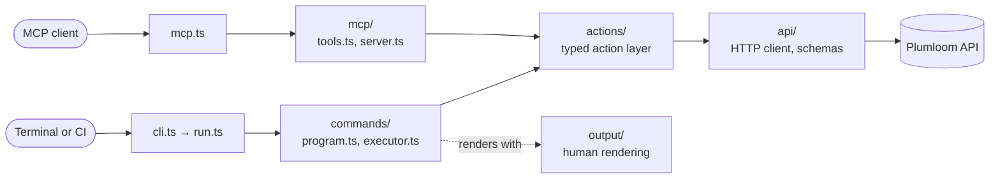

# Architecture overview

This page is for anyone changing Autoeval itself, or wanting to understand why it behaves the way it
does. If you only want to run evaluations, start with the [quickstart](./quickstart.md).

## The one-sentence model

**`actions/` is the product. The CLI and the MCP server are two thin adapters over the same typed
action layer.**

Everything Autoeval can do is a function in `actions/`. The terminal commands and the MCP tools both
call those functions directly. That is why the MCP server never shells out to the CLI, and why a
behavior fixed in an action is fixed for both at once.



`cli.ts` only calls `runCli` in `run.ts`, which loads the configuration and builds the command
program. `mcp.ts` loads the same configuration and starts the stdio server.

A concrete example: `autoeval whoami` and the MCP tool `get_current_user` both end in the same
function, `whoAmI` in `actions/identity.ts`. One is reached through `commands/`, the other through
`mcp/`. Neither knows the other exists.

## Layers

All the code ships in one package, `packages/cli`.

| Layer        | Files | Lines | Role                                                                                                                           |
| ------------ | ----- | ----- | ------------------------------------------------------------------------------------------------------------------------------ |
| `commands/`  | 3     | 2,542 | Command definitions (`program.ts`) and their execution (`executor.ts`)                                                         |
| `actions/`   | 14    | 1,839 | The typed action layer: evaluations, runs, results, suites, gates, doctor, models, workspaces, quality standards               |
| `api/`       | 5     | 1,583 | HTTP client, endpoints, response schemas, API errors                                                                           |
| `output/`    | 17    | 3,562 | Human rendering: scorecards, tables, sections, spinners, redaction                                                             |
| `mcp/`       | 4     | 581   | The stdio MCP server and its tools, over the same actions                                                                      |
| Supporting   | 30    | 3,627 | `auth/`, `polling/`, `gate/`, `suite/`, `quickstart/`, `trace/`, `configured-run/`, `domain/`, `errors/`, `runtime/`, `types/` |
| `guide/`     | 2     | 305   | Guide content                                                                                                                  |
| Package root | 5     | 318   | Entry points and configuration: `cli.ts`, `mcp.ts`, `run.ts`, `config.ts`, `version.ts`                                        |

### The dependency rule

Dependencies point down the diagram, never up:

- `commands/` imports from `actions/`; `actions/` never imports from `commands/`.
- `mcp/` imports from `actions/`.
- `api/` imports from neither. It knows nothing about the CLI or MCP.

`output/` imports five types from `actions/`: `DoctorCheck` and `DoctorReport` from `doctor.ts`,
`GateReport` from `gate.ts`, `SuiteGateResult` from `suite-gate.ts`, and `SuiteSummary` from
`suite.ts`. These are all `import type` statements, which TypeScript erases at build time, so
they create no runtime dependency. The renderer needs to know the shape of a report in order to draw
it; it never calls an action.

Keep it that way. If a new layer needs something from a layer above it, move the shared piece down
into `domain/` or `types/` rather than importing upward.

### Two files to know

`commands/executor.ts` (57 KB) is the largest source file, and `commands/program.ts` (33 KB) is the
third largest, after `output/digest.ts`. `program.ts` declares every command and its options. `executor.ts` holds one `case` per
command, which calls the action and writes the result. Almost every change to the CLI touches both.

## How to add a CLI command

The worked example is `whoami`, the smallest complete command.

1. **Write the behavior as an action**, or reuse one. `whoami` calls `whoAmI` from
   `actions/identity.ts`. Keep it free of terminal concerns: an action returns data and knows nothing
   about output formatting.

2. **Declare the command in `commands/program.ts`.** The action hands off to the executor with a
   `kind` that names the command:

   ```ts
   program
     .command('whoami')
     .description('show the authenticated Plumloom identity')
     .action(async (_options: object, command: Command) => {
       await executor.execute({ kind: 'whoami' }, executionOptions(command));
     });
   ```

3. **Handle that `kind` in `commands/executor.ts`** by adding a `case 'whoami':` that calls the
   action and writes the result, in human form or as JSON when `--json` is set.

4. **Add usage examples** to the examples map near the end of `program.ts`. These print under
   `--help`:

   ```ts
   whoami: ['autoeval whoami', 'autoeval --json whoami'],
   ```

5. **Add tests and run the checks** in [Verify a change](#verify-a-change).

## How to add an MCP tool

The worked example is `get_current_user`, which is the MCP twin of `whoami`.

1. **Reuse the action.** An MCP tool should call the same action a CLI command does.
   `get_current_user` calls `whoAmI`, exactly as `autoeval whoami` does. If the behavior does not
   exist as an action yet, add it there first (step 1 above), so the CLI can use it too.

2. **Define the tool in `mcp/tools.ts`:**

   ```ts
   defineTool({
     name: 'get_current_user',
     title: 'Get current user',
     description: 'Returns the identity associated with the configured Plumloom CLI key.',
     access: 'readOnly',
     inputSchema: emptyInputSchema,
     execute: () => actions.whoAmI(context.actions, context.signal),
   }),
   ```

   Set `access` to `'readOnly'` when the tool changes nothing, or `'stateChanging'` when it creates
   or runs something. The server marks state-changing tools for the client but adds no confirmation
   prompt of its own; the tool call is the deliberate act.

3. **Do not block on long work.** A tool that starts an evaluation returns a handle straight away;
   the client then polls `get_run_status` and fetches `get_results`. A run can outlast an MCP
   client's request timeout, and holding the call open made clients report a timeout even when the
   run had succeeded. [ADR 0005](../internal/adr/0005-asynchronous-mcp-runs.md) records the decision.

4. **Leave suites and gates out of MCP.** Gating is pure local logic over results the action layer
   already returns, so an MCP client that wants a gate reads the results and applies its own policy.

## Errors and exit codes

Every expected failure is an `AutoevalError` (`errors/autoeval-error.ts`) with a `kind`, and the kind
decides the exit code. Scripts and CI can rely on these:

| Exit code | Meaning                                | Error kinds                                                                   |
| --------- | -------------------------------------- | ----------------------------------------------------------------------------- |
| `0`       | Success                                |                                                                               |
| `1`       | A gate did not pass                    | `gate_failed`: a failed gate, or a suite `FAIL` or `INCONCLUSIVE`             |
| `2`       | The command or its input was wrong     | `usage`, `validation`, `unsupported`                                          |
| `3`       | Credentials or permissions             | `authentication`, `authorization`, `plan_restriction`                         |
| `4`       | Could not reach, or trust, the service | `network`, `upstream`, `timeout`                                              |
| `5`       | A run did not complete                 | `run_failed`: a run that ended in a non-`COMPLETED` state, or a suite `ERROR` |

When you add a failure, reuse an existing kind before inventing one. A new kind changes what CI sees.

## Verify a change

```bash
pnpm typecheck
pnpm lint
pnpm test
pnpm boundary:check
```

`pnpm test` runs the full suite with no network and no credentials. The live tests in `tests/live/`
are excluded by the Vitest configuration on purpose, and run separately with `pnpm test:live`.
`boundary:check` confirms nothing private has crept into the published package.

## Architecture decisions

The reasons behind several constraints are recorded as ADRs in
[`docs/internal/adr/`](../internal/adr/):

| ADR                                                          | Decision                                             |
| ------------------------------------------------------------ | ---------------------------------------------------- |
| [0001](../internal/adr/0001-pivot-only-client-boundary.md)   | The CLI talks only to the configured Autoeval API    |
| [0002](../internal/adr/0002-cli-credential-storage.md)       | Where the CLI stores credentials                     |
| [0004](../internal/adr/0004-mcp-peer-entry-point.md)         | MCP as a peer entry point, not a CLI wrapper         |
| [0005](../internal/adr/0005-asynchronous-mcp-runs.md)        | MCP runs submit and return rather than block         |
| [0007](../internal/adr/0007-cli-release-gate.md)             | The CLI release gate                                 |
| [0009](../internal/adr/0009-suite-release-gating.md)         | Suite release gating                                 |
| [0010](../internal/adr/0010-deepseek-harness-integration.md) | DeepSeek Harness trace import                        |
| [0011](../internal/adr/0011-required-api-base-url.md)        | `AUTOEVAL_API_BASE_URL` is required, with no default |

For the step-by-step flow behind each part, see [core workflows](./core-workflows.md).
