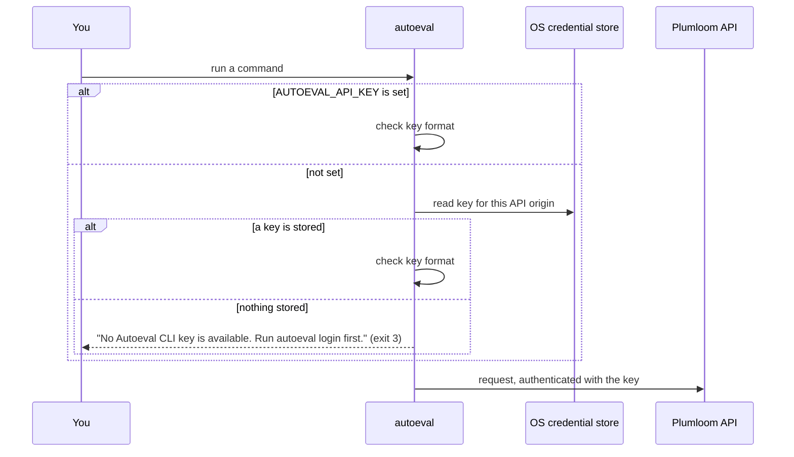
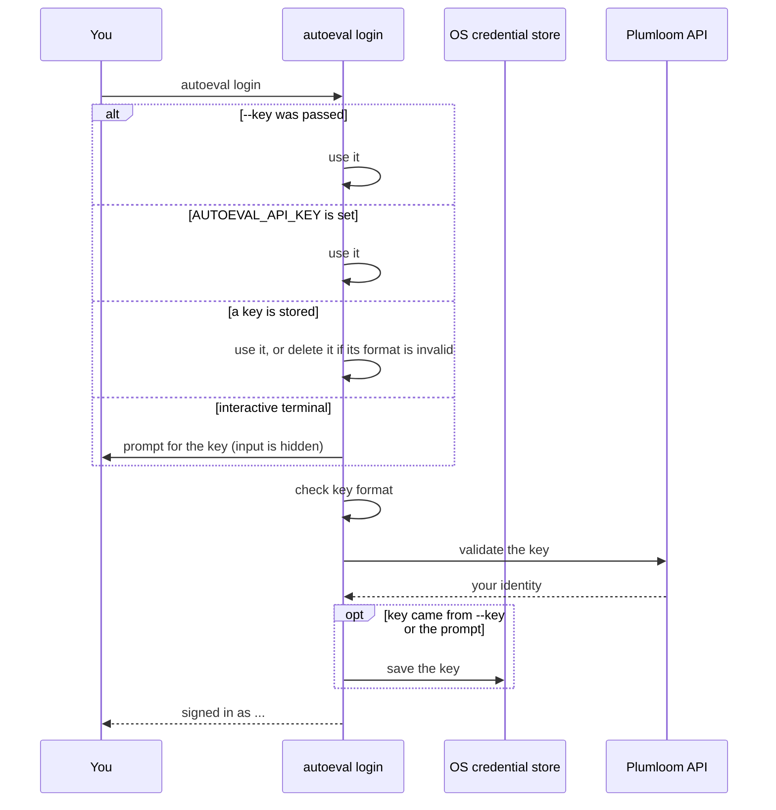
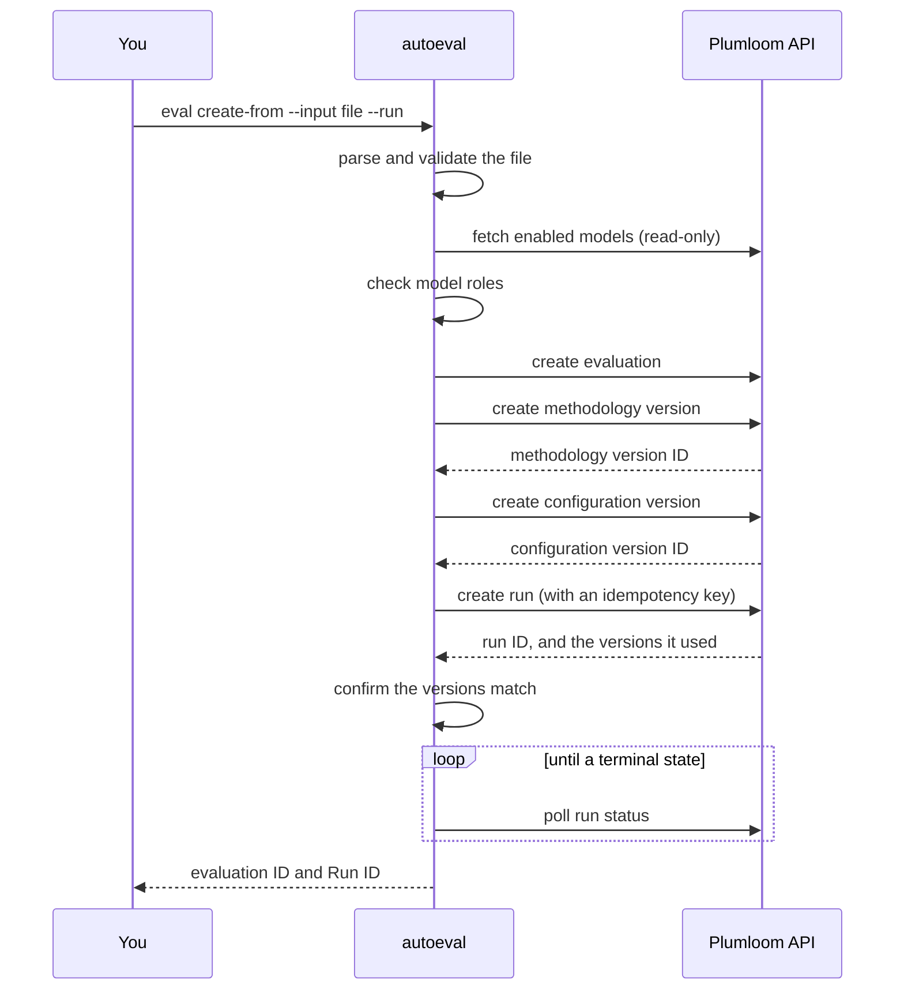
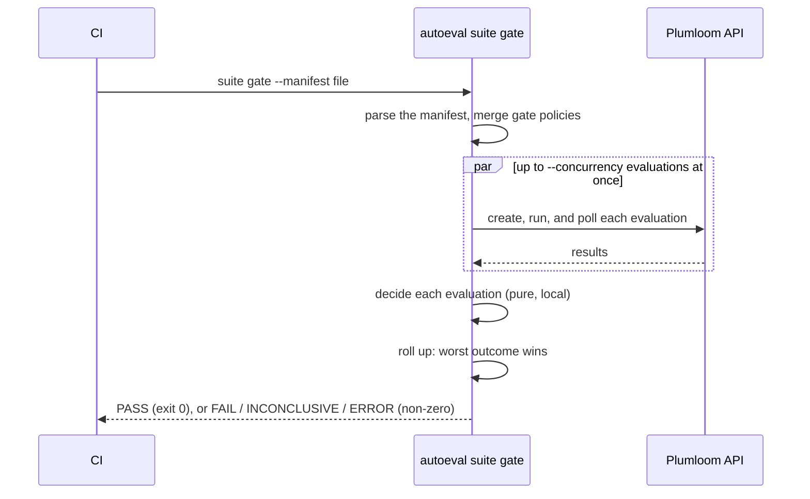
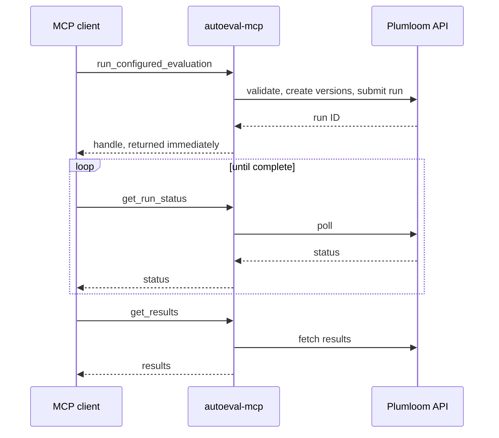

# Core workflows

Four flows cover almost everything Autoeval does. Each section shows the sequence, the rules that
decide it, and the files that implement it, so you can follow a behavior from the command you typed
to the code that ran.

For how the layers fit together, read the [architecture overview](./architecture.md) first.

1. [Authentication and credential resolution](#1-authentication-and-credential-resolution)
2. [Evaluation lifecycle](#2-evaluation-lifecycle)
3. [Suite execution and release gating](#3-suite-execution-and-release-gating)
4. [MCP server](#4-mcp-server)

## 1. Authentication and credential resolution

Autoeval needs a Plumloom CLI key for every command that talks to the API. How it finds that key
depends on whether you are running `autoeval login` or any other command.

### Every command except `login`

Two sources, checked in this order:

1. The `AUTOEVAL_API_KEY` environment variable.
2. The OS credential store.

These commands never prompt. If neither source has a key, they stop with exit code `3`, which keeps
them safe to run in CI and scripts.

### `autoeval login`

`login` checks one more source first, and is the only command that can prompt:

1. The `--key` flag.
2. The `AUTOEVAL_API_KEY` environment variable.
3. The OS credential store. A stored key with an invalid format is deleted, then Autoeval falls
   through to the prompt.
4. A masked prompt, offered only in an interactive terminal: both standard input and standard error
   must be a terminal, and neither `--key` nor `--json` may be set.

### Rules worth knowing

- **The format check is local.** A key must start with `pl_sk_` and be at least 18 characters. A
  malformed key fails with exit code `3` before any request is made.
- **Validation happens before storage.** `login` confirms the key with Plumloom first, so an invalid
  key is never saved.
- **Only a key from `--key` or the prompt is saved.** A key read from `AUTOEVAL_API_KEY` is never
  written to disk. That is why the environment variable is the right choice for CI.
- **Stored keys are per API origin.** The key is saved under the service `Plumloom Autoeval` with the
  account `api-key:<origin>`. If you change `AUTOEVAL_API_BASE_URL`, the key stored for the old
  origin is not used, and you need to log in again.
- **A missing credential store is its own error.** A headless machine without an OS credential store
  fails with `CREDENTIAL_STORE_UNAVAILABLE`. Set `AUTOEVAL_API_KEY` instead.
- **`logout` only removes the stored key.** It does not revoke the key in Plumloom and does not unset
  `AUTOEVAL_API_KEY`.

**Implemented in:** `auth/credentials.ts` (resolution order and format check), `auth/login.ts`
(validate, then persist), `auth/keyring-store.ts` (the per-origin credential store).

## 2. Evaluation lifecycle

This is the flow behind `autoeval eval create-from --run` and `autoeval eval run-configured`: an eval
file goes in, a finished run comes out.

What happens at each step:

1. **Validate before creating anything.** The file's structure is checked, the models it names are
   confirmed as enabled on your account, and the model roles are checked: the judge cannot also be
   the primary or a comparison model, the primary cannot also be a comparison model, and comparison
   models must be unique. `eval validate` runs this step on its own and stops there.
2. **Create the evaluation.** Its title comes from the file: `evaluationName` when the file sets
   it, otherwise `contextName`, which every file must have. `eval create-from`, `suite run`, and
   `suite gate` all resolve the title this way. For example, `examples/evals/scenario-basic.json` has
   no `evaluationName`, so its evaluation is titled "Basic factual questions", its `contextName`.
3. **Create a methodology version**: the judge model, the evaluator instructions, and
   `runsPerScenario`. For a scenario evaluation, `runsPerScenario` decides whether the model under
   test runs once or across several trials. Conversation and agent-trace evaluations grade the
   conversation or trace you supply rather than running a model under test again, so for them it
   does not create multi-run evidence.
4. **Create a configuration version** for that methodology: for a scenario, the primary and
   comparison models, the prompt, and the scenarios; for a conversation or agent trace, the artifact
   and the expected outcome.
5. **Create the run.** The request carries a fresh idempotency key, and Autoeval refuses the run if
   the API reports version IDs different from the ones it just created.
6. **Poll until the run reaches a terminal state.** A run that ends in any state other than
   `COMPLETED` is an error with exit code `5`.

Two safeguards to keep in mind:

- **Autoeval does not resubmit a run on its own.** Each run submission carries a fresh idempotency
  key. If submission or polling fails, Autoeval reports the failure and stops; it does not retry the
  submission in the same command. This does not rule out every duplicate: if the API accepted the
  run but the response was lost, running the command again is a new submission with a new key, and
  it can create a second run. Check the evaluation's runs before you retry.
- **Public eval files carry no account identity.** Your account is resolved from the authenticated
  session, so no file needs editing to name you. Running an example still needs the right access:
  your account must reach the workspace and have the models enabled, and for public examples with
  placeholder model IDs you must pass `--judge-model-id` and, for a scenario, `--primary-model-id`.

`eval run-configured` validates the file (step 1), then runs steps 3 to 6 against an evaluation that
already exists, instead of creating a new one.
`autoeval run <evaluation-id>` runs steps 5 and 6 against the evaluation's saved versions, without
reading a file.

**Implemented in:** `actions/configured-runs.ts` and `actions/evaluations.ts` (the create and submit
sequence), `configured-run/validation.ts` (the model-role rules), `polling/` (waiting for a terminal
state).

## 3. Suite execution and release gating

A suite runs several evaluations and, with `suite gate`, turns their results into one release
decision.

The work happens in three planes:

1. **Run.** Evaluations start in a bounded pool, `--concurrency` at a time (default `3`), with
   `--stagger-ms` between starts (default `250`). One evaluation failing does not stop the others.
2. **Results.** Each finished run's results are fetched.
3. **Gate.** Each evaluation is decided `PASS`, `FAIL`, `INCONCLUSIVE`, or `ERROR`, then the suite
   rolls up. This plane is pure local logic over results already fetched. It makes no network calls,
   which is why it can be tested offline.

How each evaluation is decided:

- **Single-run scenario:** the score is compared against the threshold.
- **Multi-run scenario:** the 95% confidence interval is compared against the threshold. The lower
  bound at or above the threshold passes, the upper bound below it fails, and an interval that
  straddles it is `INCONCLUSIVE`.
- **Conversation and agent trace:** each metric that has a gate threshold is compared against that
  threshold. Scoring and gating are configured separately. The evaluation scores the metrics listed
  in its file's `selectedMetrics`: three to six metrics from the metric catalog, with a default set
  of completeness, factuality, fluency, helpfulness, relevance, and safety. The gate reads only the
  metrics you give a threshold to: `--metric` flags or a `--thresholds` file for `autoeval gate`, and
  the manifest's `gate` blocks for `autoeval suite gate`. A metric can be scored without being
  gated.
- **No threshold configured:** `INCONCLUSIVE`. An evaluation is never a silent pass.
- **Multi-run that did not converge:** if convergence was enabled and the consistency target was
  not reached, a result that would otherwise pass is `INCONCLUSIVE`. A `FAIL` stays `FAIL`. If the
  multi-run evaluation did not complete, the result is `ERROR`.

How the suite rolls up: the worst outcome wins, in the order `ERROR`, `FAIL`, `INCONCLUSIVE`,
`PASS`. There is no averaging and no combined suite score. The exit code tells CI which kind of
problem it is:

| Suite result             | Exit code | What it means                                                 |
| ------------------------ | --------- | ------------------------------------------------------------- |
| `PASS`                   | `0`       | Every evaluation met its thresholds                           |
| `FAIL` or `INCONCLUSIVE` | `1`       | A quality problem, or not enough evidence to decide           |
| `ERROR`                  | `5`       | An evaluation could not run, or its results could not be read |

Exit `1` is a product signal: the change regressed, or the threshold is wrong. Exit `5` is an
infrastructure problem: check credentials, model enablement, and the eval file. Thresholds live in the manifest, at suite
level and optionally per evaluation, and a per-evaluation value overrides the suite default.

`suite run` does the run and results planes without a release decision.

**Implemented in:** `suite/manifest.ts` (parse and merge), `suite/execution.ts` (the bounded pool),
`actions/suite.ts` (wiring to real actions), `gate/decision.ts` (the pure gate plane),
`actions/suite-gate.ts` (the report and exit code). See
[release gating for CI](./release-gating.md) for the manifest format and a copyable CI job.

## 4. MCP server

The MCP server lets a coding agent use Autoeval over stdio. It calls the same actions as the CLI.

The difference from the CLI is that run tools **return a handle straight away** instead of waiting.
A run can outlast an MCP client's request timeout, so the client polls `get_run_status` and then
calls `get_results`. The CLI does the same submission and adds its own wait on top.

The server exposes the following tools, marked read-only or state-changing:

| Tools                                                                                                                                                                                 | Access         |
| ------------------------------------------------------------------------------------------------------------------------------------------------------------------------------------- | -------------- |
| `get_current_user`, `list_workspaces`, `list_evaluations`, `get_evaluation`, `list_models`, `get_quality_standard`, `validate_configured_evaluation`, `get_run_status`, `get_results` | read-only      |
| `create_workspace`, `create_evaluation`, `update_evaluation_title`, `create_quality_standard`, `assign_quality_standard`, `run_configured_evaluation`, `run_evaluation`               | state-changing |

There are no suite or gate tools. An agent that wants a release decision reads the results and
applies its own policy, or runs `autoeval suite gate` from CI.

The server resolves credentials the same way as every non-`login` command, and never prompts.

**Implemented in:** `mcp/server.ts` (the stdio server), `mcp/tools.ts` (tool definitions over the
shared actions). See [MCP server](./mcp.md) for client configuration.
